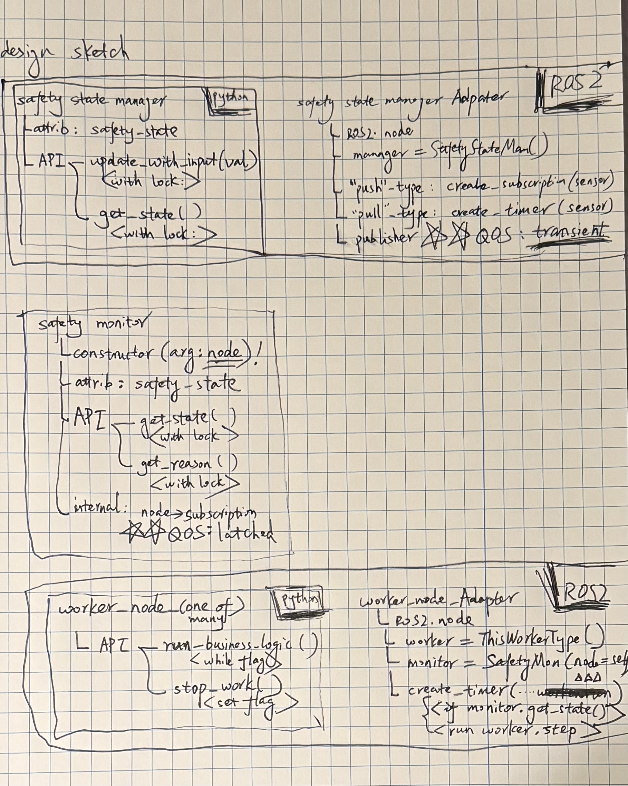

Exploration of a Robotics Application with Safety Awareness
======

# Design Descriptions
## Part 1/2: Design Considerations (last update: 10/01/2025)

click to expland

## Part 2/2: Initial Sketch (last update: 10/01/2025)

click to expland

# Implementation Notes
## Part 1: Initial implementation merged (last update: 10/03/2025)
Implementation follows exactly the Design Description above.

# TODO

Revisit NOTE's and TODO's in code and ensure alignment.